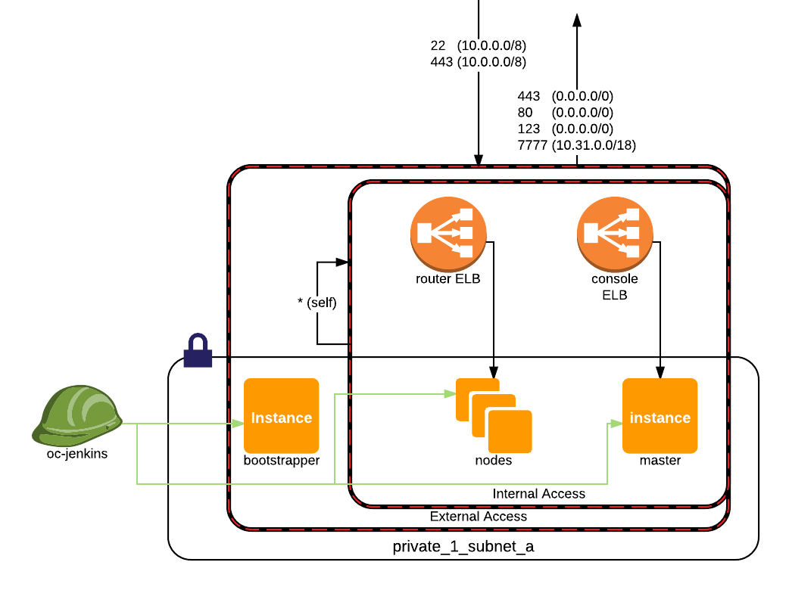

# terraform-module-openshift

This module provides a complete openshift origin cluster.


It uses the terraform workspace functionality - to get started, clone this repo, change into the implementation folder and run `terraform workspace list`.

```
* default
  ggcommontest
  ggdestest
  ggmoneytest
```

You can switch between these environments with
```terraform workspace select <envname>```

Please keep default as empty state, to prevent accidental deletion.

## Architecture

[

](https://www.lucidchart.com/invitations/accept/615dcfa2-17eb-41e3-9fbd-b05625cd253b)


## Prerequsites

1. An S3 bucket called `<AWS_ACCOUNT_ID>-terraform-state` that you can write to as PowerUser
1. The giffgaff standard network layout state in that bucket. (See https://github.com/serene-wozniak/terraform-module-ggnetwork for details)
1. Access to the tfvars file in keybase. (Ask Saflin/Miles)

### terraform.tfvars

The tfvars file contains three seperate variables, that should be kept secret:

| Variable name                      | Usage  |
|------------------------------------|-----------------|
|`git_private_key_b64`               | The private key of a user authorized to access github on behalf of the cluster. Usually the `gg-infrabot` user, hashed as base64|
|`ssh_cluster_publickey`             | The public key of the above - used by ansible on the bootstrapper box |
|`ssh_user_ca_publickey`             | The public key of the ssh certificate authority used to sign keys for ssh access to the cluster |

## Setting up a new cluster

1. Login to a PowerUserAccess role in your target AWS account via the okta cli.
1. Change into the implementation directory: `cd implementation`
1. Change the bucket name in the terraform backed in system-test.tf:
    ```
    terraform {
      backend "s3" {
        bucket = "<YOUR ACCOUNT ID HERE>-terraform-state"
        key    = "openshift"
        region = "eu-west-1"
      }
    }
    ```
1. Place the `terraform.tfvars` file from keybase in the implementation directory
1. Run `terraform workspace new <clustername>`
1. `terraform plan` to validate the setup
1. `terraform apply` to create the resource
1. Progress can then be monitored by running `ssh -l centos openshift-bootstrapper.<clustername>.aws.int.giffgaff.co.uk` and then tailing `/var/log/cloud-init-output.log`
